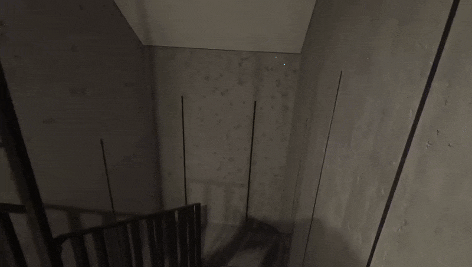
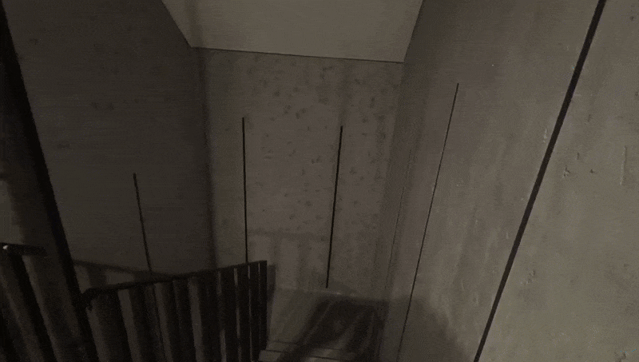

# Stairs-LED

Autorski projekt oświetlenia schodowego oparty na mikrokontrolerze **XIAO ESP32-S3** i taśmach **WS2811 COB**.  
System steruje efektami świetlnymi i sekwencją zapalania diod w oparciu o sygnały z dwóch łączników schodowych.  
Kod został napisany modułowo z myślą o łatwej rozbudowie i integracji z **Home Assistant**.

## Architektura i komponenty

Zasilanie systemu realizowane jest z **zasilacza 24 V DC** umieszczonego w rozdzielnicy głównej.  
Napięcie 24 V doprowadzone jest przewodem 1,5 mm² do taśm LED oraz do modułu sterującego w puscze podtynkowej na dole biegu schodowego  

Dwumetrowe odcinki taśmy LED **WS2811 na 24 V** zasilane są równolegle, co minimalizuje spadki napięcia i zapewnia równomierne podświetlenie.  

Na płytce prototypowej znajdują się:  
- przetwornica **DC/DC step-down 24 V → 5 V** zasilająca mikrokontroler,  
- mikrokontroler **XIAO ESP32-S3**,  
- **level shifter**, który podbija napięcie sygnału danych z 3,3 V (ESP32) do 5 V – zgodnego z wymaganiami taśm **WS2811**.  

Projekt rozwijany w **Visual Studio Code** z rozszerzeniem **PlatformIO**.  
Programowanie mikrokontrolera w języku **C++**, z użyciem biblioteki **FastLED** do sterowania taśmami LED WS2811.  

W trakcie testów rozwiązano problem spadków napięcia przy długim przewodzie zasilającym (1,5 mm², 24 V DC) poprzez podniesienie napięcia wyjściowego zasilacza 24 V DC, tak aby uzyskać 24 V w puszce z modułem sterującym.

## Sterowanie oświetleniem

System wykorzystuje dwa klasyczne łączniki schodowe – na dole i na górze schodów.  
Każdy z nich, poprzez zwarcie do masy, zmienia stan jednego z wejść mikrokontrolera **ESP32**.  
Zmiana stanu któregokolwiek łącznika powoduje zapalenie lub zgaszenie oświetlenia, zachowując logikę konwencjonalnego sterowania światłem schodowym.

Dodatkowo układ rozpoznaje, który łącznik został naciśnięty i uruchamia odpowiednią sekwencję animacji:  
- włączenie z **dolnego łącznika** – rozświetlanie taśmy **od dołu ku górze**,  
- włączenie z **górnego łącznika** – rozświetlanie **od góry ku dołowi**.  

## Tryb oszczędzania energii

Tryb **Low Energy Mode** wyłącza moduł Wi-Fi, co redukuje zużycie energii i ogranicza nagrzewanie się mikrokontrolera ESP32.  
Aktywacja i dezaktywacja odbywa się poprzez **trzykrotne szybkie przełączenie łącznika schodowego** na dole schodów.  
Dzięki temu można wyłączyć Wi-Fi na co dzień i sporadycznie je włączyć – np. w celu wgrania nowej wersji oprogramowania.  
Układ został zaprojektowany tak, aby całość była **niewidoczna i estetycznie ukryta w puszce** instalacyjnej.

---

## Podgląd działania

- 🔹 **Wejście** – zapalanie LED od dołu schodów  
  

- 🔹 **Zejście** – zapalanie LED od góry schodów  
  

- 🔹 **Low Energy Mode – aktywacja**  
  

- 🔹 **Low Energy Mode – dezaktywacja**  
  
